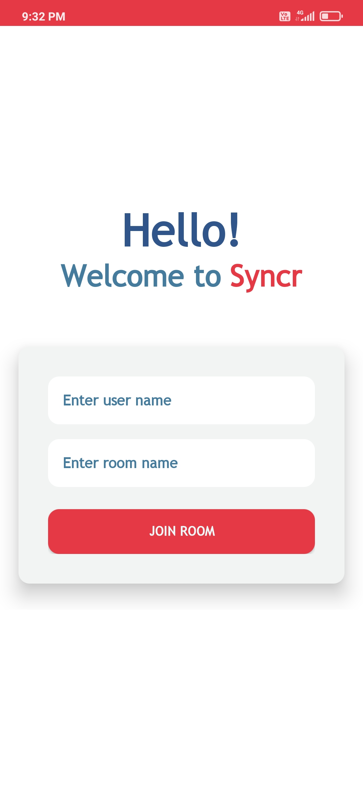
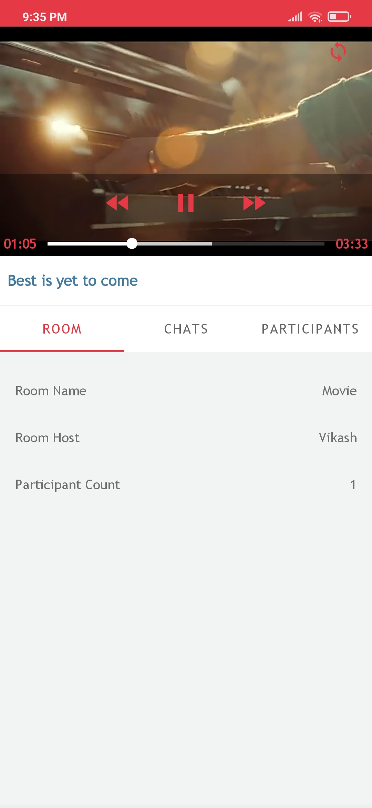
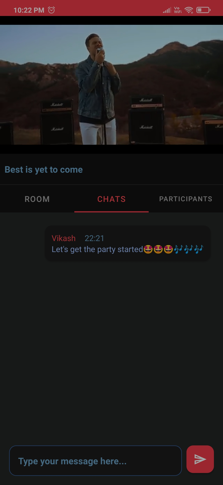

    
    <h1>Syncr Theatre App</h1>

An Android app for enjoying synchronized videos with a group of friends and chatting with them while watching videos. Also you can use your multiple smartphone in your home to create theatre like experience by placing your devices in
multiple corners of your room for playing audio and enjoying video on one of the mobile/tv screen. You might have faced low volume situation when watching movie while being on a trip with group of your friends, for that situation this app will solve that issue.

 

## Showcase
 

Day Theme

    
    

 

Night Theme

    
    

 

## Features 
- Synchronized video on multiple devices
- Streaming on TV is also supported
- Synchronized video playback events to multiple devices 
- Realtime chat with group of friends

 

## Technology used
App built with Kotlin and Android Jetpack Components.
- Single activity with multiple fragments is used with MVVM architecture. 
- Socket.io for sharing video synchronization, playback & message events.
- Jetpack libraries such as ViewModel, DataBinding, Navigation Component, LiveData.
- A server with ExpressJs is also used for communication the events with multiple devices.

 

## What's Next
- Considering round trip delay of data packets into syncronization events
- Setting up lean back mode in tv
